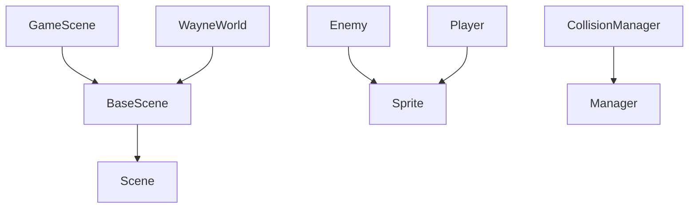

# ShooterGTU - AI-Optimized Documentation

## Project Context

This is a 2D action platformer game built with Phaser 3.87.0. The project implements a component-based architecture with clear separation of concerns.

## Project Vision

Our goal is to build a maintainable, modular 2D platformer. We want minimal coupling between managers, easy integration of LDtk levels, and the ability to change animations or UI references without breaking other parts of the game.

## AI Usage Guidelines

1. **Scope**: Only focus on the relevant file or system that needs improvement.
2. **Constraints**: Don't rename major classes or drastically alter the ECS approach.
3. **Incremental Changes**: Provide small refactors or targeted fixes rather than rewriting entire files.
4. **Explain Changes**: Always accompany code suggestions with a rationale (why these changes help).

## Core Systems and Dependencies

```json
{
  "engineVersion": "Phaser 3.87.0",
  "buildTool": "Webpack 5.91.0",
  "runtime": "Node.js",
  "renderingEngine": "WebGL/Canvas",
  "dependencies": {
    "required": ["Node.js", "WebGL-enabled browser"],
    "development": ["VS Code", "ESLint", "Prettier"]
  }
}
```

## File Structure Relationships

```plaintext
src/
├── prefabs/           # Game object classes with inheritance relationships
│   ├── Player.js      # Extends Phaser.GameObjects.Sprite
│   ├── Enemy.js       # Base enemy class
│   └── entities/      # Specialized enemy types extending Enemy.js
├── scenes/
│   ├── levels/        # Game level scenes extending BaseScene.js
│   ├── menus/         # UI scenes extending Phaser.Scene
│   └── elements/      # Reusable scene components
├── modules/
│   ├── managers/      # System managers (singleton pattern)
│   │   ├── CollisionManager.js    # Handles physics interactions
│   │   ├── AnimationManager.js    # Controls sprite animations
│   │   └── audio/                 # Audio subsystem
│   ├── state/        # Global state management
│   └── di/           # Dependency injection system
└── systems/          # Core game systems
```

## Key Class Relationships



## System Interactions

1. **Physics System**:
   - Implementation: `CollisionManager.js`
   - Dependencies: `Phaser.Physics.Arcade`
   - Key Methods: `setupCollisions()`, `handleCollision()`
   - Events Emitted: `collision`, `overlap`

2. **State Management**:
   - Implementation: `Store.js`
   - Pattern: Redux-like
   - Key Methods: `dispatch()`, `subscribe()`
   - State Schema: See `state/types.js`

3. **Event System**:
   - Implementation: `EventManager.js`
   - Event Types: See `GameEvents` enum
   - Usage: `this.events.emit(GameEvents.PLAYER_DAMAGE)`

## Code Patterns

1. **Scene Lifecycle**:
```javascript
class GameScene extends BaseScene {
    constructor() { /* Initialize components */ }
    preload() { /* Load assets */ }
    create() { /* Setup scene */ }
    update() { /* Game loop */ }
}
```

2. **Manager Pattern**:
```javascript
class BaseManager {
    constructor(scene) {
        this.scene = scene;
        this.systems = new Set();
    }
}
```

3. **Entity Component System**:
```javascript
class Entity extends GameObject {
    components = new Map();
    addComponent(component) { /* ... */ }
}
```

## Common Code Flows

1. **Collision Handling**:
```plaintext
Physics Update -> CollisionManager.check() -> 
Entity.handleCollision() -> EventManager.emit() -> 
UI Update
```

2. **State Updates**:
```plaintext
Action Dispatch -> Store.reduce() -> 
State Update -> Scene.handleStateChange() -> 
Entity Updates
```

## Testing Structure

```plaintext
tests/
├── unit/          # Jest unit tests
├── integration/   # System integration tests
└── e2e/          # Cypress end-to-end tests
```

## Development Commands

```bash
# Install dependencies
npm install

# Development server (http://localhost:8080)
npm run dev

# Production build
npm run build

# Run tests
npm test
```

## AI Assistance Notes

1. **Code Generation Context**:
   - Use ES6+ syntax
   - Follow Phaser 3 game object lifecycle
   - Implement proper cleanup in destroy() methods

2. **Common Refactoring Patterns**:
   - Extract manager classes for system-wide concerns
   - Use event system for loose coupling
   - Implement state management for complex state

3. **Debug Hooks**:
   - Debug mode: `?debug=true` URL parameter
   - Debug UI: Press 'E' in game
   - Performance monitoring: See `DebugSystem.js`

## Last Updated
2025-01-15