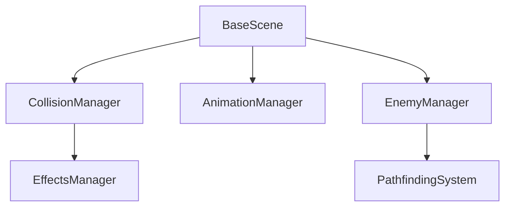
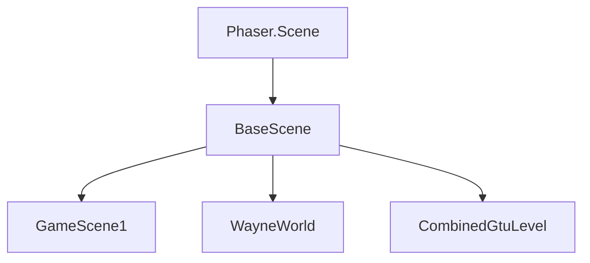
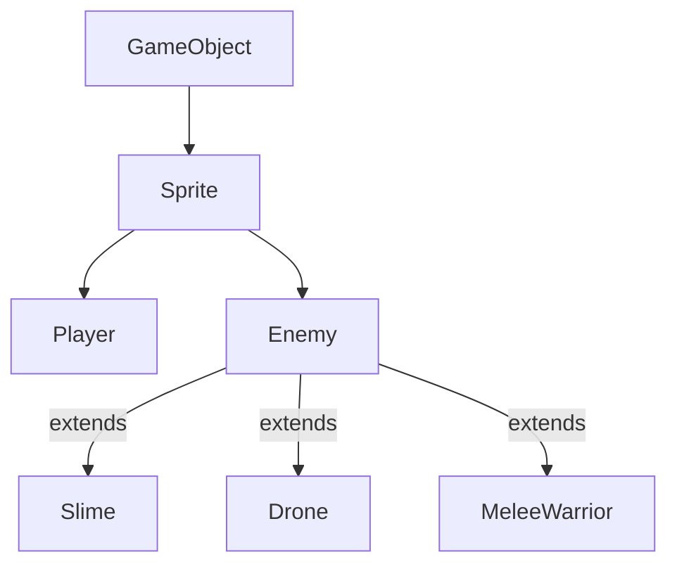

# ShooterGTU Codebase Structure

## Core Architecture

```plaintext
src/
├── prefabs/              # Game Entities & Objects
├── scenes/              # Game Scenes & UI
├── modules/             # Core Systems & Managers
├── systems/             # Game Systems
└── config/             # Configuration Files
```

## Detailed Component Structure

### 1. Prefabs (Game Entities)
```plaintext
src/prefabs/
├── Player.js              # Player character implementation
├── Enemy.js              # Base enemy class
├── entities/             # Specialized enemies
│   ├── Slime.js         # Basic enemy
│   ├── Drone.js         # Flying enemy
│   ├── MeleeWarrior.js  # Close combat enemy
│   └── Turret.js        # Stationary enemy
├── Bullet.js            # Projectile implementation
├── Bitcoin.js           # Collectible item
├── DestructibleBlock.js # Breakable environment
├── FallingDestructibleBlock.js
├── DisappearingPlatform.js
├── Trampoline.js
└── Trap.js
```

### 2. Scenes (Game Levels & UI)
```plaintext
src/scenes/
├── levels/
│   ├── BaseScene.js     # Base scene with common functionality
│   ├── WayneWorld.js    # Main level implementation
│   ├── GameScene1.js    # First game level
│   ├── CombinedGtuLevel.js
│   └── TestingGroundScene.js
├── menus/
│   └── MainMenu.js
└── elements/
    ├── UIManager.js     # UI component management
    ├── TransitionScreen.js
    └── PauseMenu.js
```

### 3. Modules (Core Systems)
```plaintext
src/modules/
├── managers/
│   ├── CollisionManager.js    # Physics & collision handling
│   ├── AnimationManager.js    # Sprite animations
│   ├── EnemyManager.js       # Enemy spawning & control
│   ├── EffectsManager.js     # Visual effects
│   ├── TextStyleManager.js   # Text styling
│   └── audio/
│       └── MusicManager.js   # Audio system
├── state/
│   ├── Store.js             # Global state management
│   └── types.js             # State type definitions
├── di/
│   └── ManagerFactory.js    # Dependency injection
└── pathfinding/            # Enemy AI movement
```

### 4. Systems (Game Logic)
```plaintext
src/systems/
├── ErrorSystem.js          # Error handling
└── DebugSystem.js         # Debugging tools
```

## Key Relationships & Dependencies

### Manager Dependencies


### Scene Hierarchy


### Entity Relationships


## System Interactions

### Collision System Flow
```plaintext
CollisionManager
├── setupCollisions()
│   ├── setupTileCollisions()
│   ├── setupEnemyCollisions()
│   ├── setupBulletCollisions()
│   └── setupPlayerCollisions()
└── handleCollision()
```

### State Management Flow
```plaintext
Store
├── dispatch(action)
├── reduce(state, action)
└── subscribe(listener)
```

### Scene Lifecycle
```plaintext
BaseScene
├── preload()  # Asset loading
├── create()   # Scene setup
├── update()   # Game loop
└── cleanup()  # Resource cleanup
```

## Common Code Patterns

1. **Manager Pattern**
```javascript
class BaseManager {
    constructor(scene) {
        this.scene = scene;
    }
}
```

2. **Entity Pattern**
```javascript
class Entity extends Phaser.GameObjects.Sprite {
    constructor(scene, x, y, texture) {
        super(scene, x, y, texture);
        scene.add.existing(this);
        scene.physics.add.existing(this);
    }
}
```

3. **Scene Pattern**
```javascript
class GameScene extends BaseScene {
    constructor() {
        super({ key: 'GameScene' });
    }
    
    create() {
        super.create();
        this.setupManagers();
        this.createEntities();
    }
}
```

## Last Updated
2025-01-15
